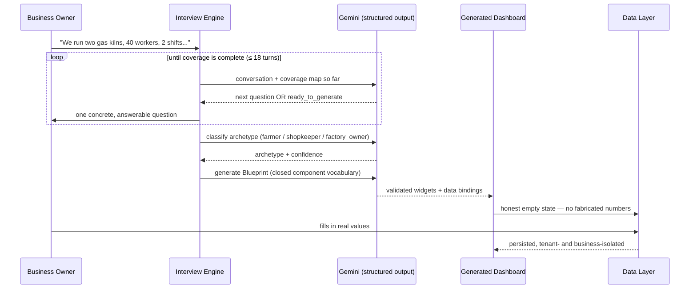

<div align="center">

# ◈ DIWAAN ◈

### *An interview becomes a business. A conversation becomes a company's mind.*

[](LICENSE)
[](backend)
[](frontend)
[](backend/services/llm.py)

</div>

---

Most software asks a business to describe itself in the software's language —
forms, dropdowns, a fixed template with your name slotted in. **Diwaan
inverts that.** You talk. It listens, classifies, and *builds the instrument
panel your business actually needs* — not a demo with your logo on it, a
working dashboard with real editable data, wired to a real backend, from the
first session.

No two interviews produce the same dashboard. A ceramic-tile factory gets
kiln throughput and breakage-loss tracking. A kirana shop gets supplier
credit terms and peak-hour footfall. Diwaan doesn't have a farmer template
and a shopkeeper template it fills in — it has a *closed vocabulary of
instruments* and an AI that decides, per business, which ones apply and what
they should be measuring.

---

## ◈ The Philosophy

Diwaan is built on three convictions about what "software for a business
owner" should mean:

> **Authority.** The dashboard belongs to the owner, not to whoever wrote the
> template. It should answer to how *this* business actually runs — not force
> the business to describe itself in software's terms.

> **Adaptive Foundations.** A farmer, a shopkeeper, and a factory owner do not
> share a mental model of their own business. Diwaan classifies which one it's
> talking to and lets that classification steer everything downstream — which
> questions get asked, which instruments get mounted, which numbers matter.

> **Formless Intelligence.** The system has no fixed shape until a
> conversation gives it one. Nothing is hard-coded per business — the shape is
> *generated*, constrained only by a closed contract of what's allowed to
> exist on a dashboard, never by what a template author anticipated.

---

## ◈ How It Works



**The interview isn't a form.** It runs on a coverage model — ten core
dimensions of a business (type, scale, revenue model, inputs/outputs, cost
drivers, customers, compliance, bottleneck, cash cycle) — and won't declare
itself ready until it has real signal on each one, or has explicitly marked
one not applicable. One question at a time, every question answerable with a
concrete fact, never re-asking what it already knows.

**The output isn't a mockup.** Every widget the AI proposes is validated
against `backend/schemas/blueprint.py` before it ever reaches the browser: a
closed set of **six components**, each carrying a `DataBinding` (a key, a
kind, a unit) instead of baked-in numbers. Nothing the AI writes is allowed
to *be* the data — it can only describe where the data lives.

| Component | What it renders |
|---|---|
| `MetricCard` | A single number with a sparkline and delta |
| `DataTable` | Editable rows the owner maintains directly |
| `ChartWidget` | A time series, with an honest "not enough data yet" state |
| `StatusBadge` | A named state (e.g. Running / Idle / Maintenance) |
| `LedgerToggle` | A one-tap logged event with a full history |
| `ListWidget` | A free-form list — activity logs, alerts, tasks |

If a dashboard has no data yet, it says so. Diwaan does not ship fake sample
numbers dressed up as your business.

---

## ◈ One Login, Many Businesses

An owner rarely runs exactly one thing. Diwaan's tenant model reflects that:
one account, any number of independently-generated dashboards — a shop
*and* a workshop, a farm *and* a trading arm — each with its own interview,
its own archetype, its own live data, switchable from one nav control.
Every widget write is scoped to `(dashboard_id, key)`, so two businesses
under the same login never see each other's numbers.

---

## ◈ Architecture

```
diwaan/
├── backend/
│   ├── api/            # FastAPI routers — auth, onboarding, dashboards, dashboard_data, specshield
│   ├── schemas/         # Pydantic contracts: Blueprint, Widget, DataBinding, the closed component vocabulary
│   ├── services/llm.py   # The one place that talks to Gemini — forces structured JSON, retries once on validation failure
│   ├── models/           # SQLAlchemy models — tenants, users, dashboards, widget data, onboarding sessions
│   ├── alembic/          # Schema migrations (SQLite + Postgres both supported, dialect-branched)
│   └── tests/             # pytest — auth, onboarding coverage, dashboard data isolation, multi-business lifecycle
├── frontend/
│   ├── src/
│   │   ├── LandingPage.jsx        # Onboarding chat + dashboard shell
│   │   ├── BlueprintRenderer.jsx  # Blueprint → live widget tree
│   │   ├── components/            # The 6 widgets, BusinessSwitcher, AuthScreen, ThreeDiwaanSeal
│   │   └── themes/                 # Per-archetype visual themes (palette, motifs, accent effects)
│   └── src/__tests__/             # Vitest
└── prompts/               # Dated work-order specs for AI-assisted implementation passes
```

**Backend:** FastAPI, async SQLAlchemy 2.0, Postgres in production /
SQLite for local dev, Alembic migrations, JWT auth (HS256, 30-minute
expiry), Gemini for every generative step — the interview turn, archetype
classification, and blueprint mutation are three separate structured-output
calls, never one call doing everything.

**Frontend:** React 19, Vite 8, no router (a small number of explicit view
states), `three` for a procedurally-generated 3D seal (no external model
files — see `frontend/CREDITS.md`), a from-scratch glassmorphic/neumorphic
design system in `frontend/src/styles/`.

**Isolation:** every query in every router filters by the authenticated
user's `tenant_id`; dashboard-data routes additionally verify the requested
`dashboard_id` actually belongs to that tenant before touching a row. A
dashboard's own binding catalog is the only source of truth for which
widget keys are writable — an empty catalog rejects every write rather than
waving it through.

---

## ◈ Spec Shield

A second module in the same app: point it at a floor-plan or procurement
document and a blueprint, and it runs a Gemini-backed comparison pass —
audit sessions, document history, and a structured comparison result, all
under the same tenant isolation as the rest of the platform. Lives in
`backend/api/specshield.py` / `frontend/src/SpecShield.jsx`.

---

## ◈ Running It Locally

**Backend**
```bash
cd backend
python -m venv venv
venv\Scripts\activate          # Windows — use `source venv/bin/activate` on macOS/Linux
pip install -r requirements.txt

# .env (not committed):
#   DATABASE_URL=sqlite+aiosqlite:///./dev.db
#   GEMINI_API_KEY=your-key-here
#   GEMINI_MODEL=gemini-3.6-flash

python scripts/seed_archetypes.py     # seeds farmer / shopkeeper / factory_owner base templates
uvicorn backend.main:app --reload     # runs `alembic upgrade head` automatically on startup
```

**Frontend**
```bash
cd frontend
npm install

# .env (not committed):
#   VITE_API_BASE_URL=http://localhost:8000

npm run dev
```

**Tests**
```bash
cd backend  && pytest
cd frontend && npm test -- --run
```

---

## ◈ Honest Status

This is a living project, not a finished product — a few things are known
and tracked rather than hidden:

- The Postgres branch of the multi-business migration is written but not
  yet verified against a real Postgres instance.
- The generation-time guard against fabricated widget data is currently a
  denylist of known-bad keys, not a true per-component allowlist.
- `google-generativeai` is end-of-life upstream; a migration to
  `google-genai` is planned but not yet done.

Dated implementation specs for work in flight live in [`prompts/`](prompts/).

---

<div align="center">

*Built on the conviction that a business's software should have to earn the
right to represent that business — by actually listening to it first.*

**[MIT License](LICENSE)**

</div>
